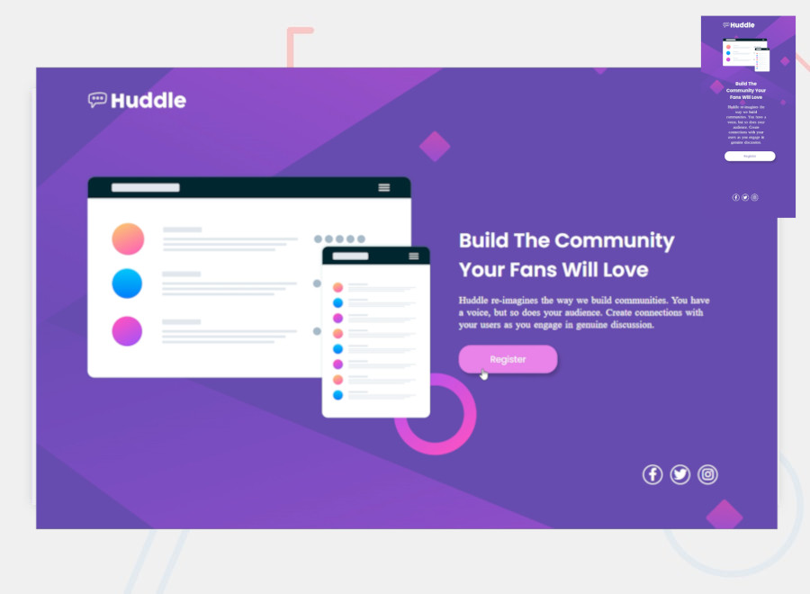
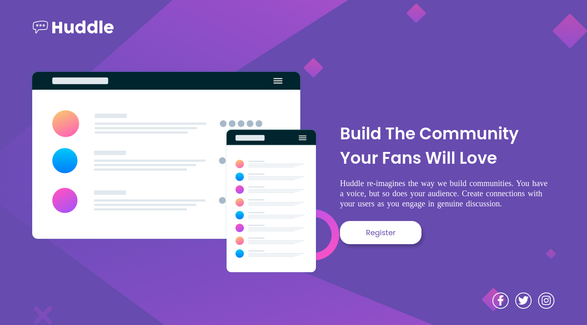
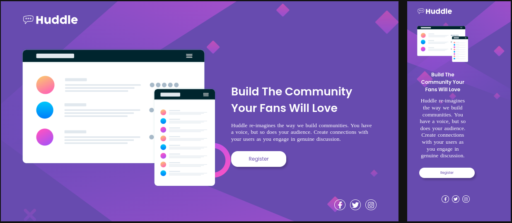
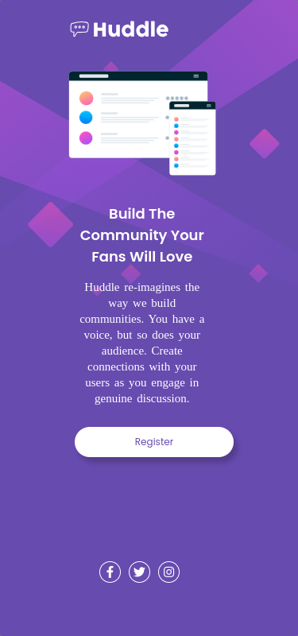

# Huddle Landing Page - Desafio HTML + CSS Avançado



Projeto de estudo feito por Fabrícia Fernandes, com 💙

## 🖇️ Índice
- <a href="#projeto">O que é este Projeto?</a>
- <a href="#layout">Layout</a>
- <a href="#video">Vídeo Demonstrativo</a>
- <a href="#rodar">Como rodar este projeto</a>
- <a href="#resultado">Resultado</a>
- <a href="#tecnologias">Tecnologias Utilizadas</a>
- <a href="#autorais">Pessoas Autorais</a>
- <a href="#passos">Próximos Passos</a>

## 📋 O que é este Projeto?

Este é um desafio proposto pelo curso [DevQuest](https://devemdobro.com), no Módulo Avançado, teve como foco a resolução do  desafio do [Frontend Mentor](https://www.frontendmentor.io/solutions/landing-page-using-display-flex-m6yHxPouoe). O objetivo é replicar o design da **Landing Page** tanto na versão **desktop (1440px** X **800px)** quanto na sua versão **mobile (375px** X **800px)**, utilizando as linguagens **HTML** e **CSS**. O projeto apresenta uma estrutura simples com um design elegante, fornecendo uma base para exibir uma mensagem de aconselhamento.

## 📌 Layout
<div align="center">
    
    
    
<div>

## 📌 Vídeo Demonstrativo
[!Huddle Landing Page](https://youtu.be/xlViGdEjKdY)

## 🔧 Como rodar este projeto
🚀 Estrutura HTML

O arquivo HTML define a estrutura da Landing Page, incluindo um botão que teoricamente servirá para o registro na plataforma. Abaixo está um resumo da estrutura HTML, seguido da estrutura de estilização com CSS:

```HTML
 <header class="logo">
    
</header>
  <main>
    <section class="section">
        
        <div class="content">
            <h1 class="title">Build The Community Your Fans Will Love</h1>
            <p class="text">Huddle re-imagines the way we build communities. You have a voice, but so does your audience. Create connections with your users as you engage in genuine discussion.</p>
            <button class="btn">Register</button>
        </div>
    </section>
  </main>
  <footer class="footer">
    <div class="social">
        <a class="midia-social" href="#">
            <i class="fab fa-facebook-f"></i>
        </a>
        <a class="midia-social" href="#">
            <i class="fab fa-twitter"></i>
        </a>
        <a class="midia-social" href="#">
            <i class="fab fa-instagram"></i>
        </a>
    </div>
  </footer>
``` 
``` CSS
html{
    font-size: 62,5%;
}
body{
    background: url('../imagens/bg-desktop.svg') center center no-repeat;
    background-size: cover;
    background-color: var(--violet);
    max-width: 1440px;
    margin: auto;
    height: 100vh;
}

.logo{
    display: flex;
    padding: 53px 70px;
}
.logo .img-logo{
    max-height: 53px;
}

.section{
    display: flex;
    align-items: center;
    justify-content: center;
    height: 65vh;
    margin: 30px 72px 0 72px;
}
.section .content{
    color: #fff;
    height: 31vh;
    margin: 0 23px 0 53px;
}
.section .content .title{
    font-family: "Poppins", sans-serif;
    font-weight: 600;
    font-size: 40px;
    margin-bottom: 20px;
}
.section .content .text{
    font-family: "Open+Sans";
    font-size: 20px;
    line-height: 25px;
    word-spacing: 2px;
    margin-bottom: 30px;
}
``` 
## 📌 Resultado
Acesse o site pronto neste link: [aqui](https://fabriciabli.github.io/desafio-html-css-avancado/)

## ⚙️ Tecnologias Utilizadas
1. [VS Code](https://code.visualstudio.com/)
2. [Perfect Pixel](https://www.welldonecode.com/perfectpixel/)

## ✒️  Pessoas Autorais

 

Fabrícia Fernandes

[Linkedin](https://www.linkedin.com/in/fabriciafernandes/)

## 📄 Próximos Passos

- [ ] Criar mais cards;
- [ ] Ativar cadastro do usuário;
- [ ] Aplicar janela para login;
- [ ] Ampliar projeto com a linguagem JS;
